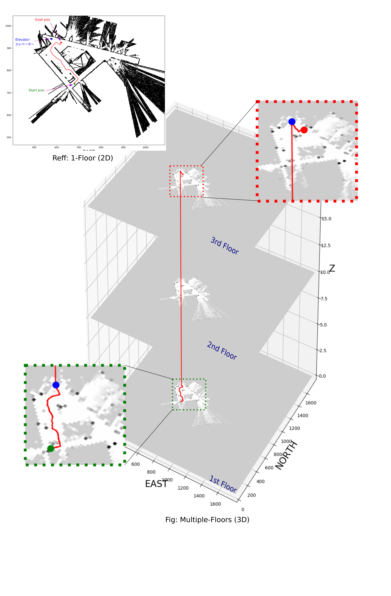
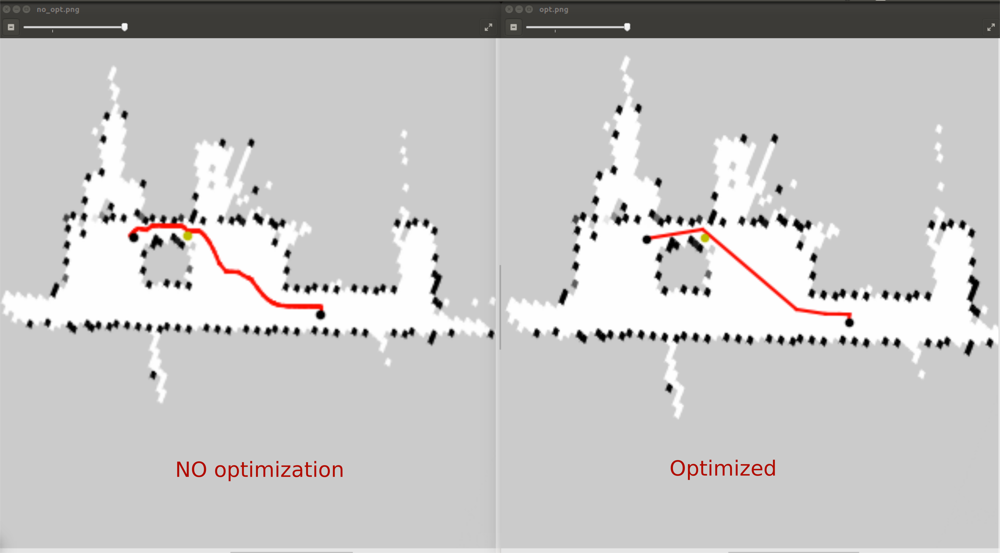

# Neo4j - graph_based_autonomous_path_planner #
## Overview: ##
Developing an optimum algorism for autonomous mobile robots (AMR) navigation based on graph structure of the input_map (pgm or png). The database which is generated from input_map will be uploaded and stored into Neo4j-enterprise. The global path planner computation will just need to access and load dataset form the site instead of reading the map again at each computational time. This approach leads to the more computational efficiency and very much suitable to use in developing such optimal platform for Robot as a Service (RaaS) either using cloud service-AWS or Neo4j services. 

<br/>
<p align="center">

<figcaption align = "center"><b>Fig.1 - Multiple-floors path generation</b></figcaption>

<br/>
It is noted that the skipped_point optimization method is added to smoothen the obtained global path. It is, however, arbitrary with/without using in python arguments. 

<br/>
<p align="center">

<figcaption align = "center"><b>Fig.2 - With/without using optimization</b></figcaption>

<br/>
This package also includes methodology for generating graph database Neo4j from raw input_map images. Furthermore, a image_filter node is attach separately in order to smoothening the raw input_maps using Dilation&Erosion functions.

<br/>
<p align="center">
_________ __maintenance by "nguyentruong.oto@gmail.com"__ _________ 
+++++++++++++++++++++++++++++++++++++++++++++++++++++++++++++++++++
</p>

## Installation neo4j - graph_based_autonomous_path_planner package ##
```shell
$ git clone https://github.com/truongsatthu/neo4j_autonomous_path_planner_project.git
```

## Usage: ##
* Step 1: Creating graph_database Neo4j
* Step 2: Adding elevator point at each floor
* Step 3: Deleting points that made by mistakes (optional)
* Step 4: Finding path by reading the existing graph_database Neo4j

Files note:
* voronoi2gdb.py	: generating graph_database Neo4j by reading input_map images
* addpoint2gdb.py	: adding points to the existing Neo4j database 
* delpoint_in_gdb.py: removing points from the existing Neo4j database 
* findingPath.py	: finding the shortest path by reading the existing graph_database Neo4j

### 1. Creating graph database Neo4j ###
* Note: Read map_file to graph_database Neo4j. Each map_file needs to be provided with an arbitrary map_id, floor_id, pgm_file, yaml_file, and neo4j_setting_file
* Keys:
	* ('-i', '--id_map')
	* ('-f', '--floor_map')
	* ('-p', '--pgm_file')
	* ('-y', '--yaml_file')
	* ('-s', '--neo4j_file')

* Usage:
```shell
$ python3 voronoi2gdb.py -i 001 -f 1 -p chinokyoten1f.png -y chinokyoten1f.yaml -s Neo4j_enterprise.yaml 
$ python3 voronoi2gdb.py -i 002 -f 2 -p chinokyoten2f.png -y chinokyoten2f.yaml -s Neo4j_enterprise.yaml
$ python3 voronoi2gdb.py -i 003 -f 3 -p chinokyoten3f.png -y chinokyoten3f.yaml -s Neo4j_enterprise.yaml
```

### 2. Adding points ###
* Note: Adding a new point to the existing graph_database Neo4j. Each adding time needs to provide the arbitrary map_id, floor_id, neo4j_setting_file, its x_y_z position, and its identifier

* Keys:
	* ('-i', '--id_map')
	* ('-f', '--floor_map')
	* ('-s', '--neo4j_file')
	* ('-e', '--elevator_pos')
	* ('-ie', '--identifier')

* Usage:
```shell
$ python3 addpoint2gdb.py -i 001 -f 1 -s Neo4j_enterprise.yaml -e 100,2240,1960 -ie EP_
$ python3 addpoint2gdb.py -i 002 -f 2 -s Neo4j_enterprise.yaml -e 200,2111,2707 -ie EP_
$ python3 addpoint2gdb.py -i 003 -f 3 -s Neo4j_enterprise.yaml -e 300,773,2633 -ie EP_
```

## 3. Deleting points ##
* Note: Deleting the existing point from the existing graph_database Neo4j. Removing point/points can be done each/one time by providing an/multiple arbitrary map_id and neo4j_setting_file and the identifier
* Keys:
	* ('-i', '--id_map')
	* ('-s', '--neo4j_file')
	* ('-ie', '--identifier')

* Usage:
```shell
$ python3 delpoint_in_gdb.py -i 001 -s Neo4j_enterprise.yaml -ie EP_
$ python3 delpoint_in_gdb.py -i 002 -s Neo4j_enterprise.yaml -ie EP_
$ python3 delpoint_in_gdb.py -i 003 -s Neo4j_enterprise.yaml -ie EP_
or:
$ python3 delpoint_in_gdb.py -i 001 002 003 -s Neo4j_enterprise.yaml -ie EP_
```

### 4. Finding shortest path ###
* Note: Read the database on the existing graph_database Neo4j to find the shortest path from the start to goal that satisfies several requirements. Each implementation needs to be provided with an/multiple arbitrary map_id and neo4j_setting_file, start_pos, goal_pos , and the optional way_points. <br/>
	The path planning algorithm 'straight' is implemented if the optional algorithm '-alg' is stated ,.e.g., '-alg st'

* Keys:
	* ('-i', '--id_map', help='map ID')
	* ('-n', '--neo4j_file')
	* ('-s', '--start_pos')
	* ('-g', '--goal_pos')
	* ('-w', '--waypoints')
	* ('-alg', '--algorithm')

* Usage:
```shell
$ python3 findingPath.py -i 001 002 003 -n Neo4j_enterprise.yaml -s 100,2672,1887 -g 300,1415,2175
$ python3 findingPath.py -i 001 002 003 -n Neo4j_enterprise.yaml -s 100,2898,1732 -g 300,1415,2175 -w 100,2100,2048 200,2140,2678 300,707,2640
$ python3 findingPath.py -i 001 002 003 -n Neo4j_enterprise.yaml -s 100,2898,1732 -g 300,1415,2175 -w 100,2100,2048 200,2140,2678 300,707,2640 -alg st
```

#### It is noted that the Neo4j access provided by author is in the read-only mode and ready-to-use. Thus, please ignore step 1,2,3 for making database (in case you want to make your own database) and go directly to step 4 to implement the algorism. ####
